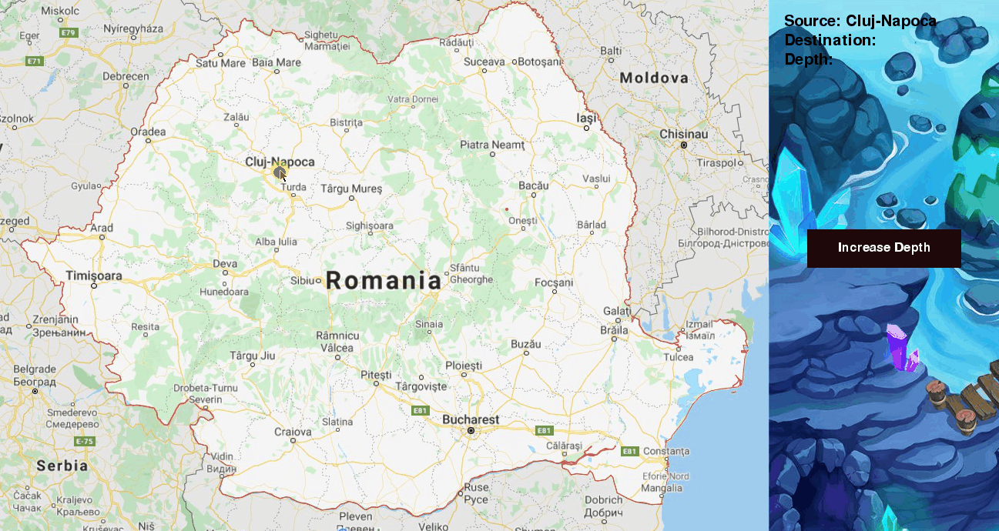

# Romania IDDFS

There are two common ways to traverse a graph, BFS and DFS. Considering a Tree (or Graph) of huge height and width, both BFS and DFS are not very efficient due to following reasons.

1. **DFS** first traverses nodes going through one adjacent of root, then next adjacent. The problem with this approach is, if there is a node close to root, but not in first few subtrees explored by DFS, then DFS reaches that node very late. Also, DFS may not find shortest path to a node (in terms of number of edges).

2. **BFS** goes level by level, but requires more space. The space required by DFS is O(d) where d is depth of tree, but space required by BFS is O(n) where n is number of nodes in tree (Why? Note that the last level of tree can have around n/2 nodes and second last level n/4 nodes and in BFS we need to have every level one by one in queue).

IDDFS combines depth-first search’s space-efficiency and breadth-first search’s fast search (for nodes closer to root).

IDDFS calls DFS for different depths starting from an initial value. In every call, DFS is restricted from going beyond given depth. So basically we do DFS in a BFS fashion.

